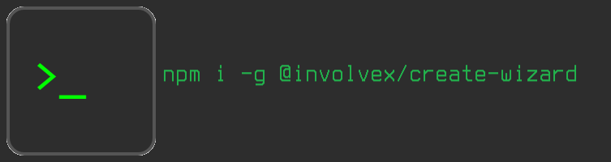

<!-- @format -->

# @involvex/create-wizard



[](https://badge.fury.io/js/%40involvex%2Fcreate-wizard)
[](https://github.com/involvex/create-wizard/actions/workflows/ci-release.yml)
[](https://github.com/involvex/create-wizard/releases/)
[](https://github.com/sponsors/involvex)

`@involvex/create-wizard` is a powerful command-line interface (CLI) tool designed to streamline and accelerate the setup of new JavaScript projects. It offers an interactive and comprehensive solution for project initialization, ensuring consistency and reducing manual setup. Our goal is to be the go-to solution for quickly building new projects.

## Features

- **Interactive Project Setup**: Guides you through project creation with prompts for project name, template selection, and additional dependencies.
- **Modern, Animated UI**: A completely redesigned interactive experience using `@clack/prompts` for a more engaging and user-friendly setup.
- **Extensive Template Library**: Choose from a wide variety of templates included with the CLI.
- **Interactive Plugin Configuration**: Use `create-wizard --plugin` to interactively configure and install plugins like Prettier, ESLint, and TypeScript.
- **Explicit Dependency Versioning**: Allows specifying exact versions for dependencies, ensuring consistent project setups.
- **TypeScript Support**: Option to initialize projects with TypeScript, including `tsconfig.json`.
- **Linting & Formatting Integration**: Choose to include ESLint and Prettier for code quality and consistent formatting.
- **Docker Support**: Option to generate a basic `Dockerfile` and `.dockerignore` for containerization.
- **CI/CD Workflow Generation**: Generate basic GitHub Actions or GitLab CI/CD pipelines.
- **Custom Template Creation**: Use `npm run template:create` to easily build and manage your own project templates.
- **Git Initialization**: Option to initialize a Git repository and make an initial commit, setting up version control from the start.

## Installation

To use `create-wizard`, you need Node.js (version 22.0.0 or higher) installed on your system.

```bash
npm install -g @involvex/create-wizard
```

## Quick Start

You can quickly create a new project using `npx` without global installation:

```bash
npx @involvex/create-wizard@latest
```

This command will execute the latest version of `@involvex/create-wizard` without download, guiding you through the project setup process.

## Usage

To create a new project, run the following command in your terminal:

```bash
create-wizard
```

The CLI will then guide you through the following steps:

1.  **Project Name**: Enter the name for your new project.
2.  **Template Selection**: Choose a template from the available options. Each template will set up a complete initial project structure, including its own `package.json` configurations (dependencies, scripts) and files.
3.  **Additional Dependency Installation**: Select any _additional_ npm packages you want to install. Note that template-specific dependencies will be installed automatically.
4.  **Optional Features**: Choose to include:
    - TypeScript support
    - ESLint for linting
    - Prettier for code formatting
    - Docker support (Dockerfile and .dockerignore)
    - GitHub Actions workflow
    - GitLab CI/CD pipeline
5.  **Git Initialization**: Confirm if you want to initialize a Git repository for your project.

## Development

### Prerequisites

- Node.js (>= 22.0.0)
- npm

### Setup

1.  Clone the repository:
    ```bash
    git clone https://github.com/involvex/create-wizard
    cd create-wizard
    ```
2.  Install dependencies:
    ```bash
    npm install
    ```

### Scripts

- **Build**: `npm run build` - Compiles the CLI tool.
- **Run**: `npm start` - Executes the compiled CLI tool.
- **Lint**: `npm run lint` - Checks code for style and quality issues.
- **Lint Fix**: `npm run lint:fix` - Fixes linting issues automatically.
- **Format Check**: `npm run format:check` - Checks code formatting.
- **Format**: `npm run format` - Formats code automatically.
- **Check**: `npm run check` - Runs linting and formatting checks.
- **Create Template**: `npm run template:create` - Interactively creates a new project template.
- **Release**: `npm run release` - Automates versioning, tagging, and pushing.

## Contributing

Contributions are welcome! Please refer to the `LICENSE` file for details.

## License

This project is licensed under the MIT License. See the [LICENSE](LICENSE) file for details.

## Support

- [Sponsor on GitHub](https://github.com/sponsors/involvex)
- [Buy Me a Coffee](https://www.buymeacoffee.com/involvex)
